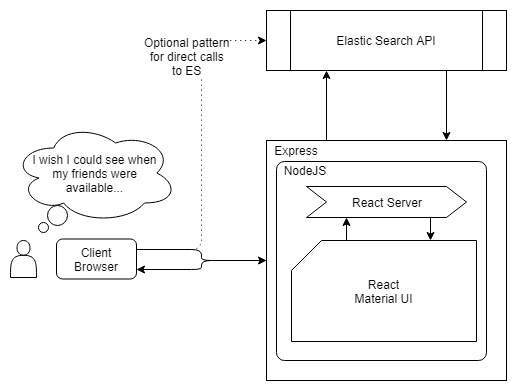

# Choreolife Events

This is a progressive web-app to help friends and family coordinate events together.

## Getting Started

1. Clone this repository: `git clone https://github.com/Choreolife/choreolife-events.git`
2. Install dependencies: `npm install`
3. Run in development mode: `npm run dev`
4. Navigate to http://localhost:3000 in a web browser.

## Architecture
  
\* Live version can be found [here](https://drive.google.com/open?id=17lUef7Pu891TNMTsNWSmNRnjJJcnojGN)

